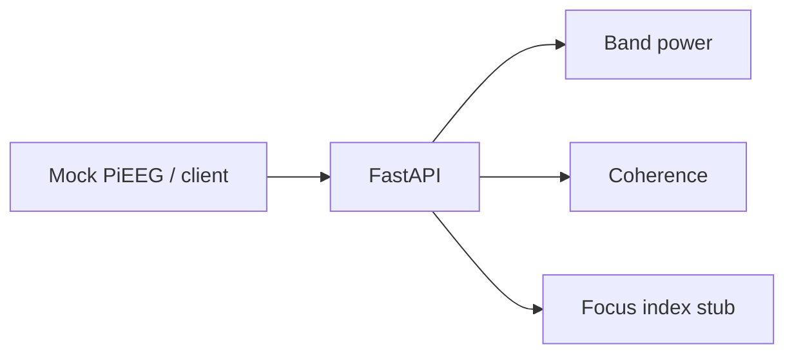

# EEG Stream API

Lightweight **FastAPI** service for **windowed EEG features** and **mock PiEEG-style streaming** — the product-facing companion to [eeg-qc-pipeline](https://github.com/ScienceSavvyChic/eeg-qc-pipeline).

Research / prototyping only. Not a medical device.

[](https://github.com/ScienceSavvyChic/eeg-stream-api/actions/workflows/ci.yml)

## What it does

| Endpoint | Purpose |
|----------|---------|
| `GET /health` | Liveness |
| `GET /v1/demo/window` | Synthetic EEG window (no hardware) |
| `GET /v1/mock/pieeg/next` | Next buffer from mock edge source |
| `POST /v1/features` | Band power + alpha/beta ratio + demo focus index |
| `POST /v1/connectivity/coherence` | Pairwise coherence in a band |
| `WS /v1/ws/stream` | Mock windows pushed every ~1s (client-driven read loop) |



## Run locally

```bash
pip install -e ".[dev]"
uvicorn eeg_stream.app:app --reload --port 8000
```

Open interactive docs: [http://127.0.0.1:8000/docs](http://127.0.0.1:8000/docs)

## Docker

```bash
docker compose up --build
curl http://localhost:8000/health
```

## Example: features from demo window

```bash
curl -s http://127.0.0.1:8000/v1/demo/window | \
  curl -s -X POST http://127.0.0.1:8000/v1/features \
    -H "Content-Type: application/json" -d @-
```

## Request body (`POST /v1/features`)

```json
{
  "sfreq_hz": 250,
  "data_uv": [[ ... channel 0 ... ], [ ... channel 1 ... ]],
  "channel_names": ["Fp1", "Fp2"]
}
```

`data_uv` is **channels × samples**, microvolts, at least **64 samples** per channel.

## Tests

```bash
pip install -e ".[dev]"
pytest
```

## Stack

Python · FastAPI · NumPy · SciPy · WebSockets · Docker

## Author

**Ashlei Lewis** — [NeuroViu](https://neuroviu.com) · [GitHub](https://github.com/ScienceSavvyChic)

MIT — see [LICENSE](LICENSE).
